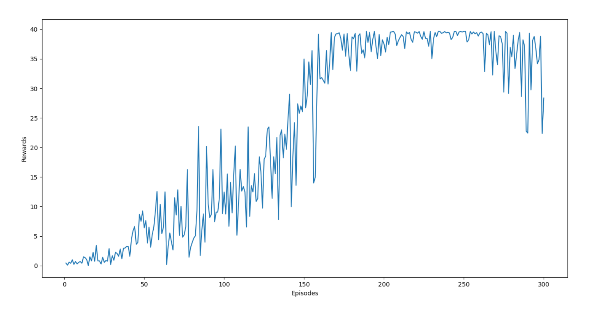

# Deep-Deterministic-Policy-Gradients
The Deep Deterministic Policy Gradient algorithm is an extension of actor critic methods to continuous action spaces. These models directly map input states to actions instead of outputting a probability distribution over discrete actions spaces. If you want to know more about actor critic methods you can read them [here](https://towardsdatascience.com/understanding-actor-critic-methods-931b97b6df3f).

# Unity ML-Agents
Unity Machine Learning Agents were developed by unity to provide game and simulation environments as training grounds for reinforcement learning. It is an open source plugin which contains already built environments along with the capacity to allow users to create their own environments. In this repository, an environment made by Udacity is used.
In the environment the goal is to maintain the arm position within the green sphere for as long as  possible. The environment is considered solved if the agent gets an average reward of 30 over 100 episodes. There won't be a need to download Unity for this project. The implementation won't work with the latest Unity ML-Agents. To reproduce the results you will need to use this environment.

# Results
The environment is considered solved if the agent can accumulate an average reward of 30 over 100 episodes. My agent was able to complete the environment in around 220 episodes. The rewards gained per episode are plotted.

# Dependencies

python == 3.6

pytorch == 0.4.0

cudatoolkit == 11.0 (Only needed if training on GPU)

# How to use my code

You will first need to install unityagents provided in this repo. To do that - 
1. Run in terminal **!pip -q install ./python**

This command needs to be run only once. After that you don't need to run this again.

To train the agent from scratch -
1. Run in terminal **python main.py**

This will start the training. If you wish to change network parameters or other hyperparameters you will have to use a python IDE of your choice and change the **main.py** and/or **networks.py** files. Once, the training is completed the model will be saved in the folder **trained_models**.

This repo contains a trained model. To watch a random agent or a smart agent play -
1. Run in terminal **python random_agent.py**
1. Run in terminal **python smart_agent.py**
